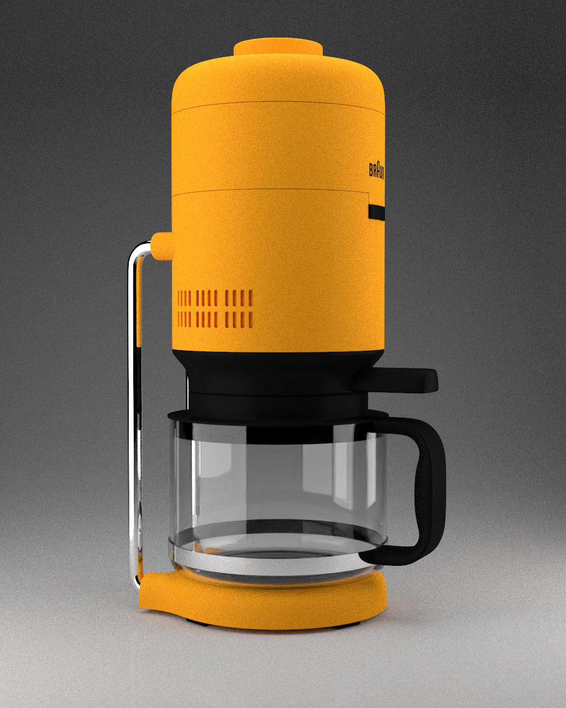
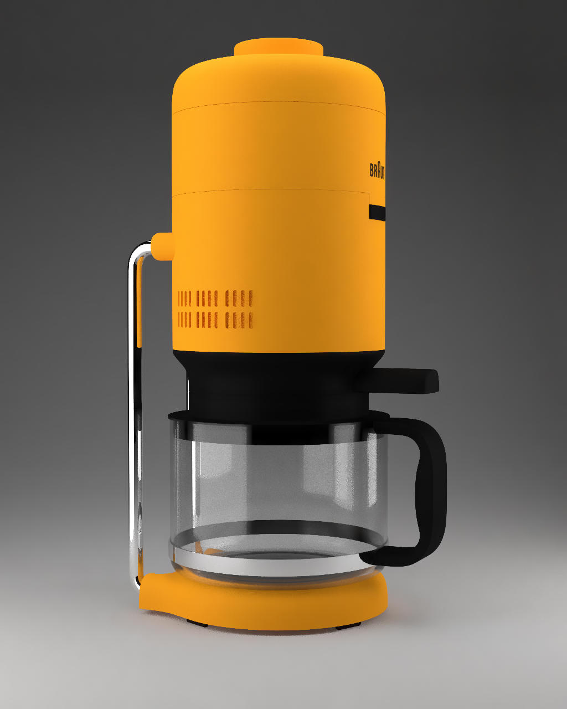
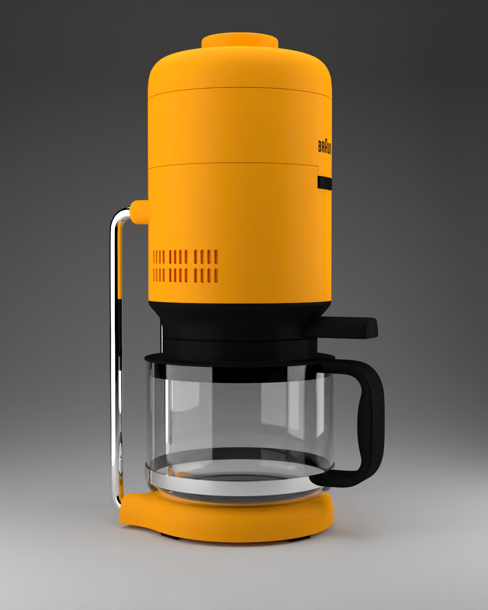
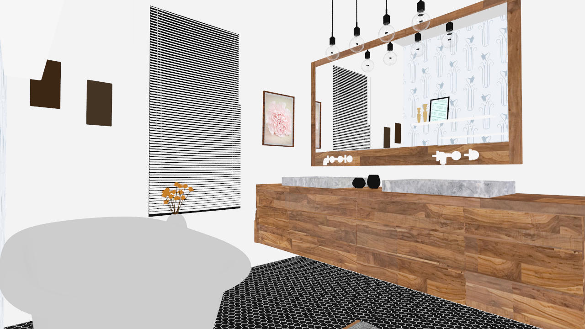
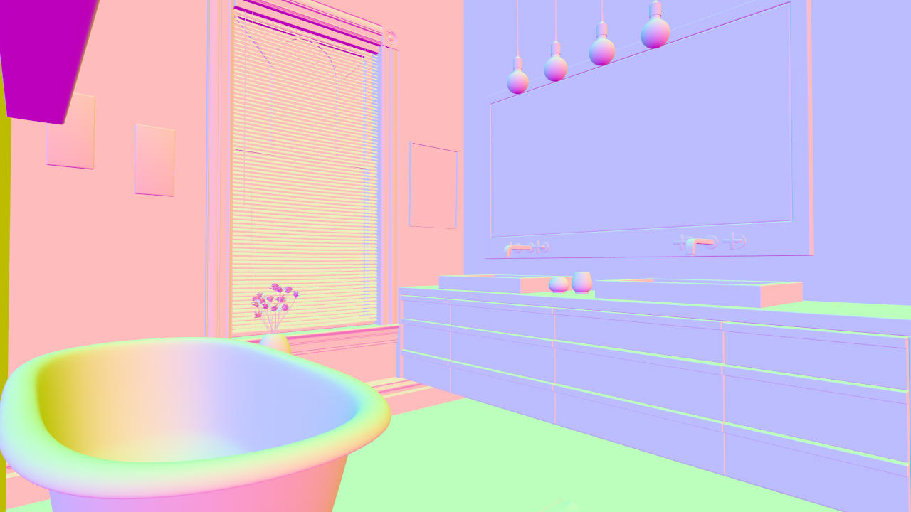
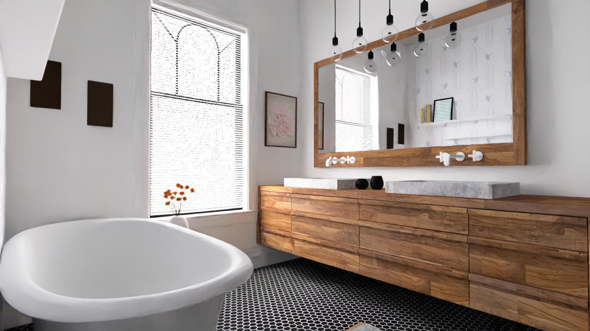
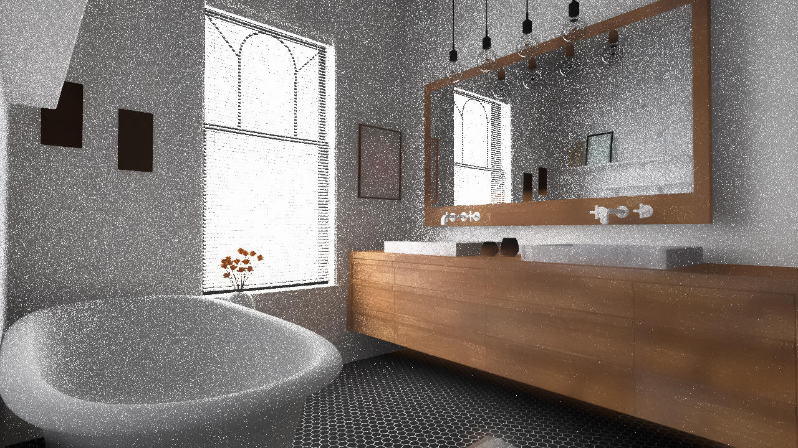
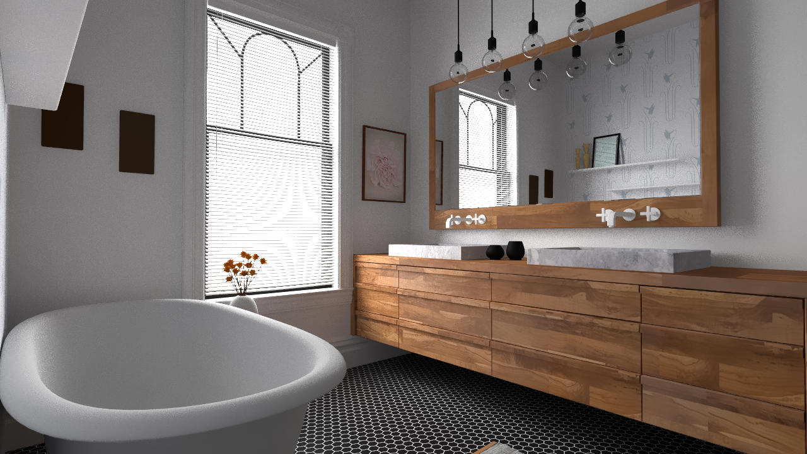
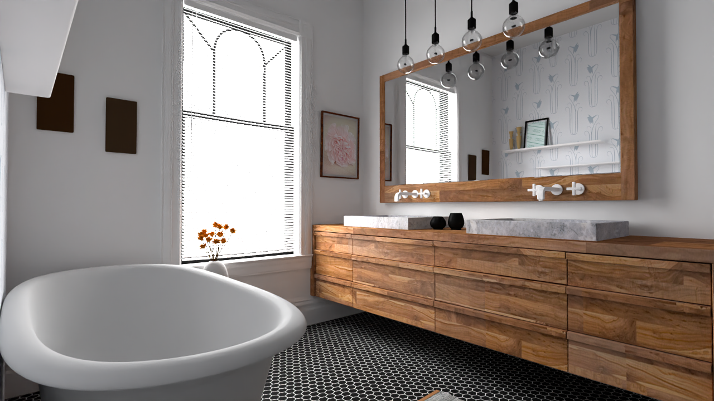
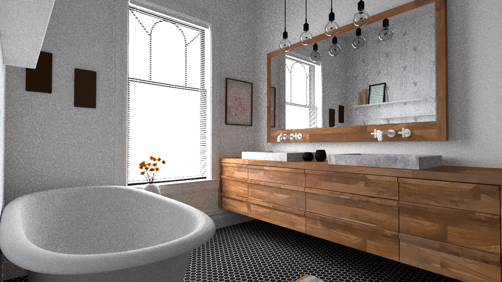

# YoctoImageDenoiser
For the final project of Computer Graphics Master Computer Science course, I implemented two kind of denoiser used to eliminate the sample noise generated on the images by MonteCarlo path tracing:
- An AI denoiser application exploiting Intel Open Image Denoiser;
- A Non Local Means denoiser application.

The project is based on the Yocto-GL Library [https://github.com/xelatihy/yocto-gl], and the denoiser applications are tested on images generated by the yocto_pathrace application. I did a little change on pathrace code, adding a function method to calculate the albedo on a input image. All the code written for the two denoiser is organized in functions that are inside the yocto_extension source file.
Is possible to build the project using CMake with the script build.sh placed in the scripts folder.

## AI Denoiser
The AI denoiser application is based on Intel Open Image Denoise library [https://openimagedenoise.github.io/]. 
Intel Open Image Denoise is an open source library of high-performance, high-quality denoising filters for images rendered with ray tracing. Intel Open Image Denoise is part of the Intel® oneAPI Rendering Toolkit and is released under the permissive Apache 2.0 license.
This kind of denoiser support both the LDR images and HDR images. For better results, the ai denoiser can set also the filter for the Normal rendering images and Albedo rendering images. This helps preserving fine details and textures in the image.
This denoiser required few seconds of computation to obtain really good results.

You can use the application yimage_intel_denoiser running the following command.
```sh
$ ./bin/yimage_intel_denoiser input_image [--alb albedo_image] [--nrm normal_image] [--hdr] [--filter RT|RTLightmap] [--srgb] [-o output_image]
```
where:
- input_image : is the image generated by the ray tracing algorithm. If the extension is .hdr the application load hdr image, otherwise simple .jpg image is used;
- -- alb : the albedo_image generated by the ray tracing algorithm. If the extension is .hdr the application load hdr image, otherwise simple .jpg image is used;
- -- nrm : the normal_image generated by the ray tracing algorithm. If the extension is .hdr the application load hdr image, otherwise simple .jpg image is used;
- --hdr : indicates that we want to use the hdr filter;
- --filter : indicates the filter type to use. By default is used 'RT' that indicates the MonteCarlo ray tracing but it is possible to use 'RTLightmap'. This is a variant of the RT filter optimized for denoising HDR lightmaps. It does not support LDR images. 
- --srgb : whether the color is encoded with the sRGB (or 2.2 gamma) curve (LDR only) or is linear; the output will be encoded with the same curve. It is not possible to set this option with --hdr option.
- -o : indicates the output path where save the result. It's possible to save both in LDR and HDR extension.

## Non Local Means Denoiser
The Non Local Means denoiser application is based on the NLM algorithm used to filter the images. 
I followed this paper [https://benedikt-bitterli.me/nfor/nfor.pdf] to implement the right weight formulas (also for the auxiliary weights like Albedo and Normal) to calculate the denoised pixels. For each image passed in input, I apply padding to keep patch and search windows of the same size for all pixels processed, even near the edges of the image. This application is  slower than AI denoiser but, using the classic weight formula, it takes approximately 2-3 minutes to generate an image.

 
You can use the application yimage_nlm_denoiser running the following command.
```sh
$ ./bin/yimage_nlm_denoiser input_image [--alb albedo_image] [--nrm normal_image] [-p dim_half_window_patch] [-s dim_half_window_search] [-h filter_param] [-a sigma] [-v] [-o output_image]
```
where:
- input_image : is the image generated by the ray tracing algorithm. If the extension is .hdr the application load hdr image, otherwise simple .jpg image is used;
- -- alb : the albedo_image generated by the ray tracing algorithm. If the extension is .hdr the application load hdr image, otherwise simple .jpg image is used;
- -- nrm : the normal_image generated by the ray tracing algorithm. If the extension is .hdr the application load hdr image, otherwise simple .jpg image is used;
- -p : indicates the half patch window side dimension. The entire window patch area is ((2 * dim_half_window_patch) + 1)^2;
- -s : indicates the half search window side dimension. The entire window search area is ((2 * dim_half_window_search) + 1)^2; 
- -h : is used to set a filter parameter value used in the weights formulas;
- -a : iinserted emperically as input);
- -v : is a boolean parameter to indicate if use the Rousselle et al. formula [https://www.cs.umd.edu/~zwicker/publications/AdaptiveRenderingNLM-SIGA12.pdf] to calculate the weights using also the pixel variance, instead of the classic formula that calculate the sum of the squared distances of the difference between the pixel to denoise and each pixel inside the search window minus two times the square of sigma parameter;
- -o : indicates the output path where save the result. It's possible to save both in LDR and HDR extension.

<b>N.B</b> = the Rousselle et al formula, during the tests,  did not give me improvements but only worsened the execution time, so I leaved the classic weight formula for the tests.

## Comparison between two denoiser
I did several tests on images generated by the yscenetrace application, trying both hdr and ldr images with 1280 of resolution and different values of samples, in particular [64, 128, 512, 1024].
The HDR output are saved with .hdr extensions and converted in .png extension using the tonemapping. The ldr images are in .jpg format.
### Example on Coffe scene 
Here on the left the ldr input image , the Intel denoiser ldr result in the central image and the NLM denoiser ldr result on the right image. All the images are with 128 samples.
<p align="center">



</p>
The outputs produced by the denoisers trying to mantain details thanks to the support of the albedo and normal images given as input. The NLM give better results on the background and plastic surfaces, while the Intel give better results on the glass and reflective part of the coffee machine, but mantains noise in the other parts of the scene.
<p>
    The following images shown the results obtained using HDR images as input.
    <p align="center">
    
    
    </p>
</p>
Here Intel remove completely the noise (image on the left), while in NLM output remains some noise on glass (image on the right). 

<br>


### Example on Bathroom scene
For this scene I tried both 64 samples and 1024 samples.
<p align="center">
    
    
    <br>
    <em> Bathroom albedo and normal input images using 64 samples. </em>
    <br>
    <br>
    
    <br>
    <em> Bathroom input image using 64 samples. </em>
</p>
<br>
This time, the Intel denoiser achieves better result than the NLM denoiser. To generate better results with NLM denoiser is possible to hypertune the parameter values like filtering parameter, sigma and the dimensions of the two windows. I tried to increment the sigma value to 100, and to increase the two windows, with no improvements. The problem is that with scenes with much light and noise, is not possible to achieve the Intel results. The following images shown the corresponding outputs.
<p align="center">
    
    <br>
    <em> Ldr Intel denoiser result. </em>
    <br>
    <br>
    
    <br>
    <em> Ldr NLM denoiser result with following parameters: -p 4 -s 20 -h 30 -a 100. </em>
    <br>
</p>

With an input more clean, for example using an images generated with 1024 samples, is possible to obtain better results with NLM denoiser respect to Intel denoiser.
<p align="center">
    
    <br>
    <em> Ldr input image with 1024 samples. </em>
    <br>
    <br>
    
    <br>
    <em> Ldr Intel denoiser result. </em>
    <br>
    <br>
    
    <br>
    <em> Ldr NLM denoiser result with following parameters: -p 3 -s 13 -h 0.60 -a 20. </em>
    <br>
</p>
This time the Intel denoiser remove just a little of the noise present in the image, while the NLM produce a good result, removing a great deal of noise, even if it slightly fades the textures of the wooden furniture.
<br>
<br>
The optimal is obtained with the HDR output image generated by Intel,while the HDR output generated by NLM doesn't increase the result.
<p align="center">
    
    <br>
    <em> HDR Intel denoiser result with 1024 samples. </em>
    <br>
    <br>
    
    <br>
    <em> HDR NLM denoiser result with 1024 samples. </em>
</p>
## Other results
Is possible to find other output results inside the folder out/.
In this folder there are both the ldr, hdr and png (hdr with tonemapping) versions.
For each of these folder there are the results of NLM and Intel. 
Each output as the same file name of the input that has generated it, and the inputs are placed in test/images/ folder. 
<br>
<b>The file name format is :</b> scene_name_resolution_samples.ext.

## Conclusions
The two applications of different denoiser, the first based on AI algorithm, the second based on the NLM algorithm, produce different results that depends principally of how much noise is present in the scene and the format of image ( .hdr or .jpg). To achieve optimal results with Intel denoiser, you have to use image with much noise, in HDR format. The algorithm remove totally the noise. While, the NLM denoiser is more efficient when there is less noise on the image and work better on ldr images.

#Author
Manuel Prandini

#License
----

MIT

